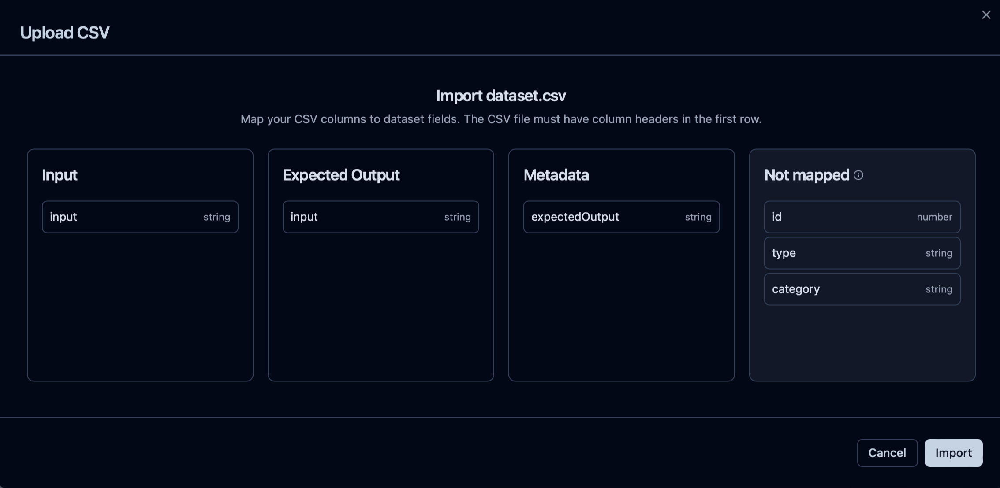
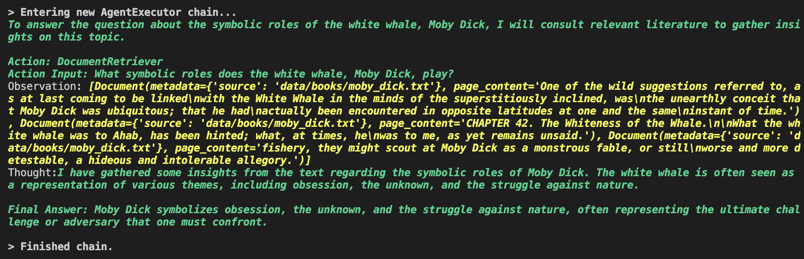
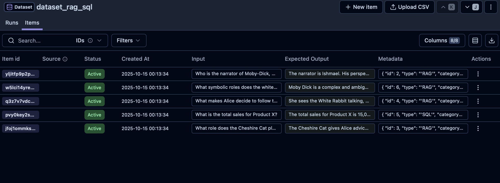
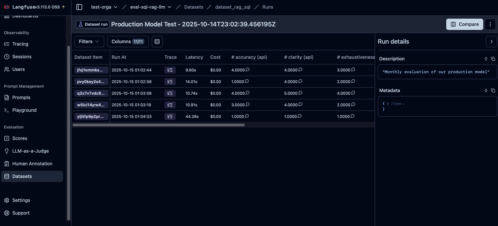
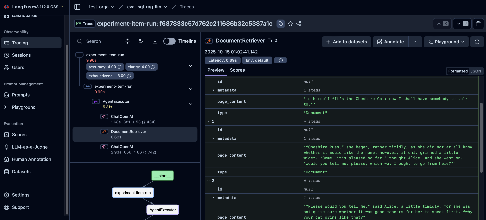

# Evaluation of an OpenAI agent with Langfuse

This repository is a short example of how we can evaluate an AI agent by using the self-hosted Langfuse framework. The agent has access to a simple RAG and SQL tools. A dataset with input questions and expected answers is given in the files, the goal is to run the agent on this dataset, then use a LLM-as-judge to compare the agent's outputs and the expected outputs. All the commands below are done from the root of this repository (except for running the docker langfuse)

## Files

- `data/books/`: contains some books in txt format for the RAG.
- `data/dataset.csv`: contains the evaluation dataset for the agent.
- `create_sql_db.py`: creates a simple SQL table which will be by default saved in `data/sale_database.db`.
- `create_vectorstore.py`: creates a vectorstore from the books, which will be by default saved in `data/chroma_db`.
- `rag_sql.py`: the main file of this repository. Sets the agent, the evaluator and runs the evaluation.
- `scoring_template.txt.jinja`: the LLM-as-judge prompt.
- `requirement.txt`: the dependencies needed for running the evaluation.

## Set-up

1. Create and start a virtual environment.

2. Install all the libraries in `requirement.txt`:

```shell
pip install -r requirements.txt
```

3. Install [Docker Desktop](https://www.docker.com/products/docker-desktop/) on your computer

4. Clone the latest Langfuse repository:

```shell
git clone https://github.com/langfuse/langfuse.git
cd langfuse
```

5. Start the Langfuse application:

```shell
docker compose up -d
```

6. Open http://localhost:3000 in your browser to access the Langfuse UI. Enter your email adress and set a password for user identification. Go to the settings to get your first public and secret keys.

7. Go to Datasets and create a new one by using the `data/dataset.csv` file. You can slide the columns of the file to the correct class on the UI. Multiple features can be added to 'metadata'.



8. Go back to the Python SDK, and create a `.env` file in the repository folder to write the API keys inside, with the following global variables:

```shell
export OPENAI_API_KEY=""
export LANGFUSE_PUBLIC_KEY=""
export LANGFUSE_SECRET_KEY=""
export LANGFUSE_HOST="http://localhost:3000"
```

9. Run to activate the API keys:

```shell
source .env
```

## How to run the evaluation

1. Create the RAG vectorstore by running:

```shell
python create_vectorstore.py
```

2. Create the SQL by running:

```shell
python create_sqldb.py
```

3. Write the name given to the dataset (step 7) in `rag_sql.py` at line 204 (variable `dataset_name`). Set `save_result = True` (line 205) and create a folder `results/` for saving locally the evaluation. Set `False` otherwise.

4. Run the evaluation:

```shell
python rag_sql.py
```

## Examples

1. Run in the terminal



2. The Langfuse UI with the items of the dataset



3. The evaluation result on the Langfuse UI



4. An example of tracing


